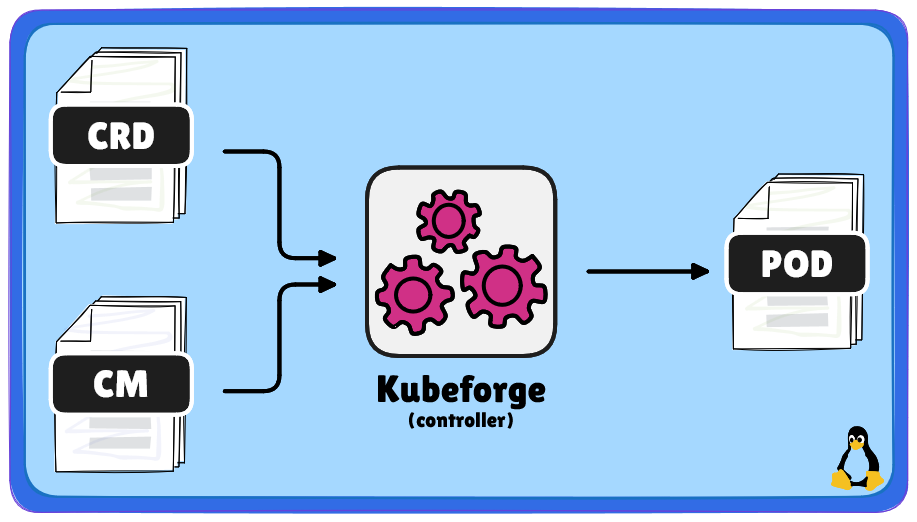

   <!-- logo -->
   

            
   

    
  
   <!-- labels -->
   
   
   

   

      
      
   

   

<!---
$$\   $$\          $$\                  $$$$$$\                                         
$$ | $$  |         $$ |                $$  __$$\                                        
$$ |$$  /$$\   $$\ $$$$$$$\   $$$$$$\  $$ /  \__|$$$$$$\   $$$$$$\   $$$$$$\   $$$$$$\  
$$$$$  / $$ |  $$ |$$  __$$\ $$  __$$\ $$$$\    $$  __$$\ $$  __$$\ $$  __$$\ $$  __$$\ 
$$  $$<  $$ |  $$ |$$ |  $$ |$$$$$$$$ |$$  _|   $$ /  $$ |$$ |  \__|$$ /  $$ |$$$$$$$$ |
$$ |\$$\ $$ |  $$ |$$ |  $$ |$$   ____|$$ |     $$ |  $$ |$$ |      $$ |  $$ |$$   ____|
$$ | \$$\\$$$$$$  |$$$$$$$  |\$$$$$$$\ $$ |     \$$$$$$  |$$ |      \$$$$$$$ |\$$$$$$$\ 
\__|  \__|\______/ \_______/  \_______|\__|      \______/ \__|       \____$$ | \_______|
                                                                    $$\   $$ |          
                                                                    \$$$$$$  |          
                                                                     \______/                         
--->
# Kubeforge

The Kubeforge is a Kubernetes-native solution that addresses the limitations of dynamic resource provisioning. It uses the Kubernetes controller pattern to merge user-defined Custom Resource Definitions (CRDs) with source pre-definied configuration, enabling consistent and automated resource provisioning.

> [!NOTE] 
> Imagine a scenario where each pod within your scope needs to be slightly different, you have the option to install them separately or use Kubeforge. With Kubeforge, you can define the [source configuration](charts/kubeforge/values.yaml#L107-L126) and only operates with [overlays](charts/kubeforge/templates/tests/bannana.yml#L14-L62) resources.

##
<!---
#####################################################
# TL;DR
#####################################################
--->
<h3 id="tldr">
   $\large\color{Goldenrod}{\textbf{TL;DR}}$
</h3>

$\color{#FAFAD2}{\textsf{Preparation}}$

 

Add the Helm chart repository.

   
    helm repo add kubeforge https://wsadza.github.io/kubeforge && helm repo update

   

$\color{#EEE8AA}{\textsf{Installation}}$

 

Install the Kubeforge Helm chart with a customized source configuration

    cat <<EOF | helm install kubeforge kubeforge/kubeforge -f -
    kubeforge:
      sourceConfiguration:
        Pod:
        - metadata:
            name: bannana-pod 
          spec:
            containers:
              - name: bannana 
                command: [ "tail", "-f", "/dev/null" ]
    EOF
    

$\color{#F0E68C}{\textsf{Usage}}$

 

Create a Kubeforge Overlay resource to provision the "banana-pod"

   
    cat <<EOF | kubectl apply -f -
    apiVersion: kubeforge.sh/v1
    kind: Overlay
    metadata:
      name: "bannana" 
    spec:
      data:
        Pod:
          - metadata:
              name: bannana-pod 
            spec:
              containers:
              - name: bannana 
                image: busybox 
    EOF

   

<!---
$$$$$$$\  $$$$$$$\  $$$$$$$$\ $$\    $$\ $$$$$$\ $$$$$$$$\ $$\      $$\ 
$$  __$$\ $$  __$$\ $$  _____|$$ |   $$ |\_$$  _|$$  _____|$$ | $\  $$ |
$$ |  $$ |$$ |  $$ |$$ |      $$ |   $$ |  $$ |  $$ |      $$ |$$$\ $$ |
$$$$$$$  |$$$$$$$  |$$$$$\    \$$\  $$  |  $$ |  $$$$$\    $$ $$ $$\$$ |
$$  ____/ $$  __$$< $$  __|    \$$\$$  /   $$ |  $$  __|   $$$$  _$$$$ |
$$ |      $$ |  $$ |$$ |        \$$$  /    $$ |  $$ |      $$$  / \$$$ |
$$ |      $$ |  $$ |$$$$$$$$\    \$  /   $$$$$$\ $$$$$$$$\ $$  /   \$$ |
\__|      \__|  \__|\________|    \_/    \______|\________|\__/     \__|
--->
## Preview

   <code>It was easy, right?</code>
    
    
   

   
   
      

<!---
$$$$$$$$\  $$$$$$\   $$$$$$\  
\__$$  __|$$  __$$\ $$  __$$\ 
   $$ |   $$ /  $$ |$$ /  \__|
   $$ |   $$ |  $$ |$$ |      
   $$ |   $$ |  $$ |$$ |      
   $$ |   $$ |  $$ |$$ |  $$\ 
   $$ |    $$$$$$  |\$$$$$$  |
   \__|    \______/  \______/
--->
## Table Of Contents:
- [Usage](#usage)
- [Development](#development)
- [Miscellaneous](#miscellaneous)

<!---
$$\   $$\  $$$$$$\   $$$$$$\   $$$$$$\  $$$$$$$$\ 
$$ |  $$ |$$  __$$\ $$  __$$\ $$  __$$\ $$  _____|
$$ |  $$ |$$ /  \__|$$ /  $$ |$$ /  \__|$$ |      
$$ |  $$ |\$$$$$$\  $$$$$$$$ |$$ |$$$$\ $$$$$\    
$$ |  $$ | \____$$\ $$  __$$ |$$ |\_$$ |$$  __|   
$$ |  $$ |$$\   $$ |$$ |  $$ |$$ |  $$ |$$ |      
\$$$$$$  |\$$$$$$  |$$ |  $$ |\$$$$$$  |$$$$$$$$\ 
 \______/  \______/ \__|  \__| \______/ \________|
--->

## Usage
[(Back to Top)](#table-of-contents) 

This section provides guidance on deploying and configuring streaming instances using Docker, Docker Compose, and Kubernetes (K8S) manifests. It includes specific instructions for different Linux distributions and GPU acceleration.

### Table Of Contents:
  - $\large\color{Goldenrod}{\textbf{Usage}}$
     - [Usage `Standalone`](./.docs/10_usage/USAGE.md#usage---docker) 
     - [Usage `Kubernetes`](./.docs/10_usage/USAGE.md#usage---docker-compose)

<!---
$$$$$$$\  $$$$$$$\  $$$$$$$$\ $$\    $$\ $$$$$$\ $$$$$$$$\ $$\      $$\ 
$$  __$$\ $$  __$$\ $$  _____|$$ |   $$ |\_$$  _|$$  _____|$$ | $\  $$ |
$$ |  $$ |$$ |  $$ |$$ |      $$ |   $$ |  $$ |  $$ |      $$ |$$$\ $$ |
$$$$$$$  |$$$$$$$  |$$$$$\    \$$\  $$  |  $$ |  $$$$$\    $$ $$ $$\$$ |
$$  ____/ $$  __$$< $$  __|    \$$\$$  /   $$ |  $$  __|   $$$$  _$$$$ |
$$ |      $$ |  $$ |$$ |        \$$$  /    $$ |  $$ |      $$$  / \$$$ |
$$ |      $$ |  $$ |$$$$$$$$\    \$  /   $$$$$$\ $$$$$$$$\ $$  /   \$$ |
\__|      \__|  \__|\________|    \_/    \______|\________|\__/     \__|
--->
<h2>Preview</h2>

   <code>Take a piece of CRD, mix it with the flavor of CM, and voilà, you have your pod!</code>
    
    
   

         
   

<!---
$$$$$$$\  $$$$$$$$\ $$\    $$\ $$$$$$$$\ $$\       $$$$$$\  $$$$$$$\  $$\      $$\ $$$$$$$$\ $$\   $$\ $$$$$$$$\ 
$$  __$$\ $$  _____|$$ |   $$ |$$  _____|$$ |     $$  __$$\ $$  __$$\ $$$\    $$$ |$$  _____|$$$\  $$ |\__$$  __|
$$ |  $$ |$$ |      $$ |   $$ |$$ |      $$ |     $$ /  $$ |$$ |  $$ |$$$$\  $$$$ |$$ |      $$$$\ $$ |   $$ |   
$$ |  $$ |$$$$$\    \$$\  $$  |$$$$$\    $$ |     $$ |  $$ |$$$$$$$  |$$\$$\$$ $$ |$$$$$\    $$ $$\$$ |   $$ |   
$$ |  $$ |$$  __|    \$$\$$  / $$  __|   $$ |     $$ |  $$ |$$  ____/ $$ \$$$  $$ |$$  __|   $$ \$$$$ |   $$ |   
$$ |  $$ |$$ |        \$$$  /  $$ |      $$ |     $$ |  $$ |$$ |      $$ |\$  /$$ |$$ |      $$ |\$$$ |   $$ |   
$$$$$$$  |$$$$$$$$\    \$  /   $$$$$$$$\ $$$$$$$$\ $$$$$$  |$$ |      $$ | \_/ $$ |$$$$$$$$\ $$ | \$$ |   $$ |   
\_______/ \________|    \_/    \________|\________|\______/ \__|      \__|     \__|\________|\__|  \__|   \__|
 --->
## Development
[(Back to top)](#table-of-contents)

This section explains how we build our software, focusing on different structures like monolithic and distributed systems. You will also find information about our development workflows, including continuous integration and delivery.

### Table Of Contents:
  - $\large\color{Goldenrod}{\textbf{Development - Structure}}$
     - [Development - Structure - Monolithic](./.docs/40_development/structure/MONOLITHIC.md#development---structure---monolithic)
   
     - Development - Structure - Distributed
   
     - Development - Structure - Repository
    
  - $\large\color{Goldenrod}{\textbf{Development - Workflow}}$
     - Development - Workflow - CI
   
     - Development - Workflow - CD
   

<!---
$$$$$$$\  $$$$$$$\  $$$$$$$$\ $$\    $$\ $$$$$$\ $$$$$$$$\ $$\      $$\ 
$$  __$$\ $$  __$$\ $$  _____|$$ |   $$ |\_$$  _|$$  _____|$$ | $\  $$ |
$$ |  $$ |$$ |  $$ |$$ |      $$ |   $$ |  $$ |  $$ |      $$ |$$$\ $$ |
$$$$$$$  |$$$$$$$  |$$$$$\    \$$\  $$  |  $$ |  $$$$$\    $$ $$ $$\$$ |
$$  ____/ $$  __$$< $$  __|    \$$\$$  /   $$ |  $$  __|   $$$$  _$$$$ |
$$ |      $$ |  $$ |$$ |        \$$$  /    $$ |  $$ |      $$$  / \$$$ |
$$ |      $$ |  $$ |$$$$$$$$\    \$  /   $$$$$$\ $$$$$$$$\ $$  /   \$$ |
\__|      \__|  \__|\________|    \_/    \______|\________|\__/     \__|
--->
<h2>Preview</h2>

   <code>Sequences! We love sequences, right?</code>
    
    
   

         
   

<!---
$$\      $$\ $$$$$$\  $$$$$$\   $$$$$$\  
$$$\    $$$ |\_$$  _|$$  __$$\ $$  __$$\ 
$$$$\  $$$$ |  $$ |  $$ /  \__|$$ /  \__|
$$\$$\$$ $$ |  $$ |  \$$$$$$\  $$ |      
$$ \$$$  $$ |  $$ |   \____$$\ $$ |      
$$ |\$  /$$ |  $$ |  $$\   $$ |$$ |  $$\ 
$$ | \_/ $$ |$$$$$$\ \$$$$$$  |\$$$$$$  |
\__|     \__|\______| \______/  \______/
--->
## Miscellaneous
[(Back to top)](#table-of-contents)

The "Miscellaneous" section gathers various resources and content that may not belong to a specific category but are still valuable and worth referencing. It's a place for extra tools, tips, and information that support a wide range of needs.

### Table Of Contents:
- $\large\color{Goldenrod}{\textbf{Helpful Resources}}$
   - [Helpful Resources - Setup](./.docs/50_miscellaneous/MISCELLANEOUS.md#helpful-resources---setup)
   - [Helpful Resources - Questions / Answers](./.docs/50_miscellaneous/MISCELLANEOUS.md#helpful-resources---questions---answers)
- [Document Template](./.docs/50_miscellaneous/DOCUMENT_TEMPLATE.md)

 
 

   

